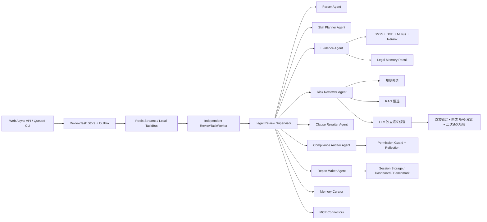

# 企业法务 Agent 执行工作台架构

本项目是面向企业合同审查的 Agent 执行平台，不是单一问答 Demo。核心目标是让每次合同审查都成为可追踪、可治理、可复核、可评测的 `ReviewRun`。

## 能力映射

| 能力 | 项目实现 |
| --- | --- |
| Agent Runtime / Loop | `legalworkbench.runtime.engine.LegalAgentRuntime` 保持对外 API，`legalworkbench.agents.LegalReviewSupervisor` 负责创建 `review_run_id` 并推进 parse、retrieve、risk_check、rewrite、compliance、report 状态 |
| Tool Registry | `legalworkbench.tools.ToolRegistry` 统一注册合同解析、RAG 检索、规则判断、条款改写、权限审查、报告导出工具 |
| Permission Checker | `legalworkbench.governance.LegalPermissionChecker` 和 `PermissionGuard` 控制敏感合同、无来源法律判断、高风险外部写入 |
| Identity / RBAC | `legalworkbench.auth.AuthManager` 校验 HS256 JWT 并生成 `Principal`；FastAPI 依权限执行端点授权，local 模式仅用于单人开发兼容 |
| Tool Policy / HITL | `ToolPolicyMiddleware` 是 `ToolRegistry.execute()` 的 fail-closed 必经层；校验用户、租户、角色权限、工具 scope、读写类型和敏感资源，外部副作用使用加密、单次消费的人工审批账本 |
| LLM Gateway / Trace | Worker 复用 `httpx.Client` keep-alive 连接池；每次模型调用生成归属于 ReviewRun/Agent/task 的 `LLMCallTrace`，统计 token、延迟、缓存、重试、fallback 与配置单价成本 |
| Memory | `legalworkbench.memory.LegalMemoryStore` 以 Proposed → Approved → Active 状态机治理跨会话记忆；高风险、注入命中和 LLM-only 结论未经人工确认不能参与召回 |
| Skills | `legalworkbench.skills.SkillCatalog` 根据 SaaS、采购、NDA 等合同类型选择审查技能和风险重点 |
| MCP / Connectors | `legalworkbench.connectors` 作为企业系统连接层，接飞书、Notion、OA、合同库、CRM 等外部系统 |
| Multi-Agent Workflow | `legalworkbench.agents/` 采用 Supervisor-Worker 模式，拆分 Parser、Skill Planner、Evidence、Risk Reviewer、Rewriter、Compliance Auditor、Report Writer、Memory Curator |
| Session Storage | `legalworkbench.storage.ReviewSessionStore` 保存每次审查会话快照、状态、工具链路和报告位置；`storage.backend=postgres` 时与 Run/Task/Memory/Event 统一写入 PostgreSQL JSONB |
| Dashboard | `legalworkbench.web` 提供交互式网页工作台，展示任务状态、风险数量、工具调用、记忆命中和评测输出 |
| Benchmark | `legalworkbench.evals.BenchmarkRunner` 衡量风险召回、来源覆盖率、工具成功率、记忆召回率和拦截率 |
| Reflection | `legalworkbench.reflection.ReflectionAuditor` 对无来源判断、高风险建议和绝对化结论做二次复核 |
| Compact | `legalworkbench.compact.LegalContextCompactor` 生成保留关键条款、风险、来源和状态的压缩快照 |
| Hooks | `legalworkbench.hooks.HookEventBus` 记录 review/tool/risk 事件，作为审计和外部通知扩展点 |

## 执行链路



## Agent 通信模型

本项目没有采用自由聊天式 swarm，而是采用强约束的 Supervisor-Worker 架构：

- 主 Agent：`LegalReviewSupervisor`，负责任务编排、状态推进、失败处理、最终持久化。
- 子 Agent：`ParserAgent`、`SkillPlannerAgent`、`EvidenceAgent`、`RiskReviewerAgent`、`ClauseRewriterAgent`、`ComplianceAuditorAgent`、`ReportWriterAgent`、`MemoryCuratorAgent`。
- 通信方式：所有 Agent 通过 `ReviewRun` 共享状态和结构化 `agent_steps` 交换结果，不通过自然语言互聊。
- 审计方式：所有工具调用写入 `ToolCallTrace`，trace metadata 会记录 `agent` 和 `agent_role`。
- RAG 定位：RAG 不是独立决策 Agent，而是 `EvidenceAgent` 调用的检索能力层；风险结论由 `RiskReviewerAgent` 和 `ComplianceAuditorAgent` 交叉确认。
- 语义候选：`RiskReviewerAgent` 并行合并规则、RAG 和 LLM 独立候选。LLM 候选不受不利模式硬门控，但必须使用风险类型白名单、引用合同原文、取得同类 RAG 证据并通过二次语义核验；独立候选一律标记人工复核。
- 记忆隔离：Memory Curator 可将需复核结论保存为 `proposed` 审计候选，但召回层只接受 `approved` / `active`。人工操作必须按 approve → activate 状态迁移，不能从 proposed 绕过审批直接激活。
- API/Worker 隔离：Web 审查端点只持久化任务并发布到 TaskBus，立即返回 HTTP 202；只有独立 `ReviewTaskWorker` 可以调用 Agent Runtime。Redis 模式由 Consumer Group 分发给多个 Worker，本地模式复用同一消费接口进行文件轮询降级。
- 身份传播与租户边界：JWT 被解析为 `Principal(tenant_id, user_id, roles)`；Web 在文档、任务、报告、会话和事件查询前执行租户过滤，TaskBus 将租户/用户传给 Worker，Runtime 再传播到 ReviewRun、ToolContext、ToolCallTrace 与 Legal Memory。平台设置端点仅允许 `admin`。公共知识标记为 `shared`；词法和 Milvus 检索均在召回时执行 `shared OR current tenant` 预过滤，PostgreSQL RLS 仍是后续生产化增强。
- 工具策略：注册工具必须声明 `ToolPolicy(scope, access, required_permission)`，缺失策略默认阻断。`external_write` 不会直接执行，而是产生不保存明文参数的审批记录；批准凭证同时绑定 tenant、requester、review run、tool 与参数摘要，且执行成功前即原子消费，防止跨租户、换参数和重放。审批 API 需要 `operator` 以上权限，并禁止请求人自批。
- 评测与可观测性：`LegalAgentRuntime(memory_enabled=False)` 提供长期记忆 ON/OFF 消融；真实评测支持冻结的 `heldout` 数据集。SSE 事件携带单调 `event_id`，支持 `Last-Event-ID` 续传和按 `run_id` 过滤。LLM 可按 `plan_review`、`refine_query`、`discover_risks`、语义核验任务配置不同模型，并将实际模型写入 `LLMCallTrace`。

## MCP 在本项目中的作用

MCP 在这里不是上传功能，而是企业系统交互层。法务 Agent 可以通过 connector 发现和调用外部 tools/resources：

- 从飞书文档读取合同正文、制度文件和审批上下文
- 从 Notion 查询合同审查 playbook、供应商历史风险和审查记录
- 将审查报告写回飞书或 Notion
- 为高风险条款创建 OA/飞书审批任务
- 写入审计日志，保留“谁在什么时候基于哪些来源生成了什么建议”

MCP 连接只走真实 MCP SDK client（stdio/http）：连接成功读取真实 tool/resource 目录，失败如实报 `failed` 并附错误原因，不提供任何 mock 目录兜底。未配置连接器时功能整体不可用并明确提示，而不是假装可用。

## 目录结构

```text
src/legalworkbench/
  runtime/        Runtime 门面，对外提供 review/eval/dashboard API
  agents/         Supervisor-Worker 多 Agent 编排
  tools/          可注册工具和工具调用 trace
  rag/            合同条款知识库检索
  memory/         长期审查记忆与沉淀
  governance/     权限、规则、合规拦截
  skills/         合同类型技能
  workflow/       多角色审查流程
  connectors/     MCP/企业系统连接层
  storage/        session 和 run 存储
  evals/          benchmark 指标评测
  tasks/          审查任务队列
  hooks/          runtime 事件总线
  reflection/     二次复核
  compact/        长合同上下文压缩
  web.py          交互式网页工作台
  cli.py          命令行入口
```
